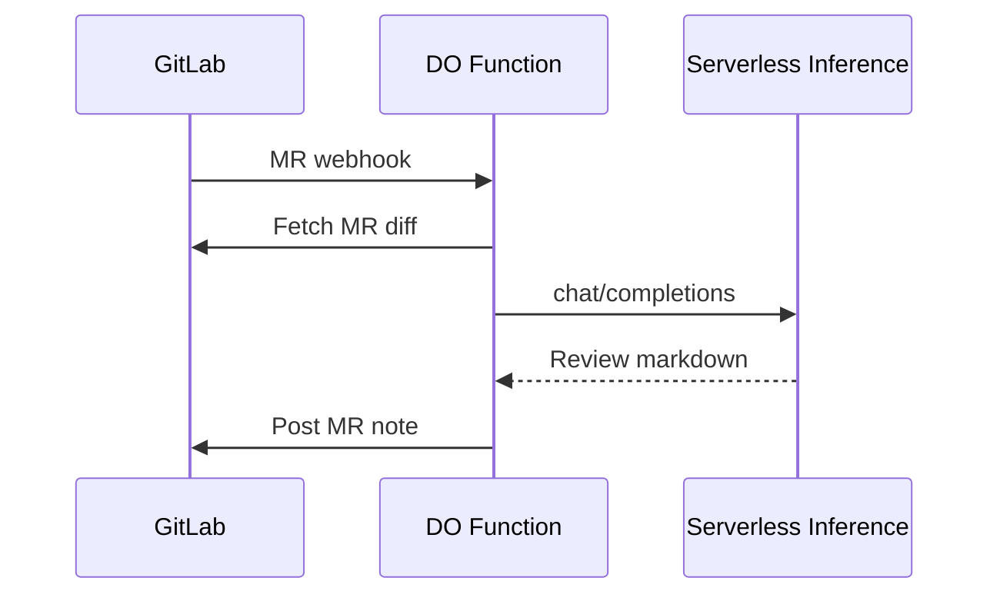

# Code_reviewer_sample

| You do in the UI               | Link                                                                                              |
| ------------------------------ | ------------------------------------------------------------------------------------------------- |                                          |
| Create model access key        | [Model access keys](https://cloud.digitalocean.com/gen-ai/model-access-keys)                      |
| Paste function code            | [Functions](https://cloud.digitalocean.com/functions) → Source → `ui-deploy/gitlab_mr_webhook.py` |
| Encrypted secrets              | Function → **Settings → Environment variables** (Encrypt)                                         |
| GitLab webhook                 | [Project hooks](https://gitlab.com/ashokmookkaiah-group/sample-ai-reviewer/-/hooks)               |

GitLab repo: **[https://gitlab.com/ashokmookkaiah-group/sample-ai-reviewer](https://gitlab.com/ashokmookkaiah-group/sample-ai-reviewer)**

## Architecture

## Secrets (no `.env` files)

Store `GITLAB_TOKEN`, `GITLAB_WEBHOOK_SECRET`, `MODEL_ACCESS_KEY`, and `DATABASE_URL` as **encrypted** variables in App Platform (or Functions Settings). 

